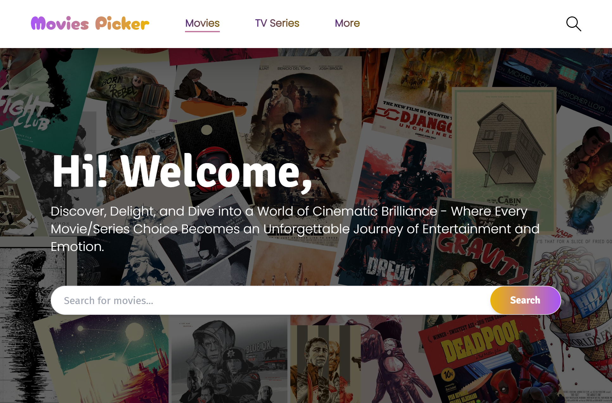
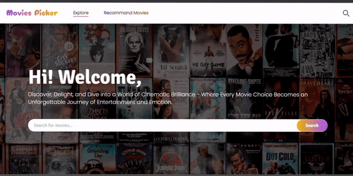

  

<h1 align="center">Movies Picker</h1>

  A Dynamic, Responsive, and Beautiful Movie Picking Application.

  <a href="https://movies-picker.vercel.app/">Live Link</a> |
  <a href="https://github.com/vishal-kumaar/moviespicker">GitHub Repository</a>

  

## 📖 About

Movies Picker is a visually appealing and interactive movie browsing application that allows users to explore and discover their favorite movies. Whether you're in the mood for action, romance, or comedy, Movies Picker has got you covered!

## 🚀 Features

- Browse through different movie categories and genres.
- Access detailed information about movies, including cast, crew, trailers, budget, and more.
- Search for movies and personalities related to the film industry.
- Get personalized movie recommendations based on your preferences.
- Enjoy a responsive and user-friendly interface.

## 🛠️ Tech Stack

The Movies Picker application is built using the following technologies:

- **ReactJS** - A powerful JavaScript library for building user interfaces.
- **TailwindCSS** - A utility-first CSS framework for fast and responsive web development.
- **Axios** - A JavaScript library for making HTTP requests to retrieve data from the TMDB API.
- **TMDB API** - The Movie Database API, providing extensive movie-related data.

## 🛠️ Installation

1. Clone the repository: `git clone https://github.com/vishal-kumaar/moviespicker.git`
2. Navigate to the project directory: `cd moviespicker`
3. Install the dependencies: `npm install`
4. Set up your TMDB API key by following the instructions in <a href="https://developer.themoviedb.org/">TMDB Docs</a>.
5. Create a `.env` file in the root directory and add a environment variable `REACT_APP_API_KEY=Your_tmdb_api_key`.
6. Start the development server: `npm start`

## 🌟 Showcase

  

## 🤝 Contributing

Contributions are welcome! If you find any bugs or have suggestions for new features, please feel free to open an issue or submit a pull request.

## 💬 Connect with Me

- Twitter: [@vishalkumar0837](https://twitter.com/vishalkumar0837)
- LinkedIn: [Vishal Kumar](https://www.linkedin.com/in/vishal-kumar-909758228)
- Instagram: [@\_visshal_yadav](https://www.instagram.com/_visshal_yadav)

Check out my personal website [here](https://vishalkumar.vercel.app) to learn more about my work and projects.